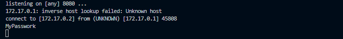
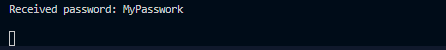

# CWE-311 Missing Encryption of Sensitive Data

## Descripción
El producto no encripta información crítica o sensible antes de almacenarla o transmitirla.

El servidor puede ser iniciado utilizando el comando:

## Pasos de ejecución
```bash
// Construcción de imagen de servidor
docker build . -t cwe-311-server:v1

// Ejecución de contenedor
docker run -it -p 8080:8080 cwe-311-server:v1
```

Un cliente interactivo para realizar la conexión se puede crear utilizando la imagen de cliente

```bash
// Construcicón de imagen de cliente
docker build . -t cwe-311-client:v1 

// Ejecución intercativa de cliente
docker run -it --network=host cwe-311-client:v1
```
Una vez conectado el cliente, desde el servidor se podrá simular envío de información y revelar como el cliente expone esta información.

