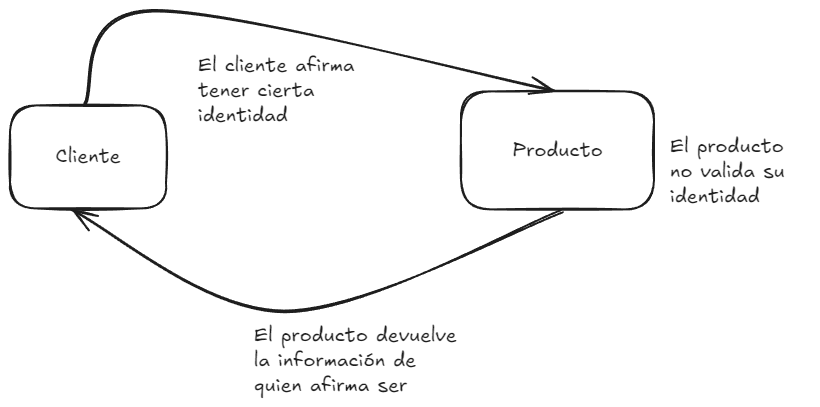

# CWE-287: Improper Authentication

## Descripción
La vulnerabilidad CWE-287 ocurre cuando una aplicación no verifica adecuadamente la identidad de un usuario antes de concederle acceso a recursos o funcionalidades protegidas. Esto puede llevar a accesos no autorizados y posibles ataques de escalación de privilegios.

Este ejemplo muestra un error en la autenticación dentro de una aplicación Express, donde solo se verifica la existencia del nombre de usuario sin comprobar la contraseña.



## Código de Ejemplo
El archivo `server.js` contiene el siguiente código:

```javascript
const app = express();
app.use(express.urlencoded({ extended: true }));
app.use(cookieParser());
app.use(helmet()); 

// Simulated database 
const users = {
    admin: {
        username: 'admin',
        passwordHash: bcrypt.hashSync('admin', 10), // Hashed password
        role: 'admin'
    }
};

// Secure session configuration
app.use(session({
    secret: crypto.randomBytes(64).toString('hex'), 
    resave: false,
    saveUninitialized: false,
    cookie: {
        httpOnly: true,
        sameSite: 'Strict',
        maxAge: 1000 * 60 * 15
    }
}));

// Function to authenticate user
function authenticateUser(username, password) {
    const user = users[username];
    return user && bcrypt.compareSync(password, user.passwordHash);
}

// Authentication middleware
function requireAuth(req, res, next) {
    if (!req.session.user) {
        return res.status(401).send('Error: Authentication required');
    }
    next();
}

// Admin authorization middleware
function requireAdmin(req, res, next) {
    if (!req.session.user || req.session.role !== 'admin') {
        return res.status(403).send('Error: Access denied');
    }
    next();
}

// Login route
app.post('/login', (req, res) => {
    const { username, password } = req.body;
    if (!authenticateUser(username, password)) {
        return res.status(401).send('Error: Invalid credentials');
    }

    // Set session on the server
    req.session.user = username;
    req.session.role = users[username].role;
    res.send('Login successful');
});

// Logout route
app.post('/logout', (req, res) => {
    req.session.destroy(err => {
        if (err) {
            return res.status(500).send('Error logging out');
        }
        res.send('Session successfully closed');
    });
});

// Protected route for admins only
app.get('/admin', requireAuth, requireAdmin, (req, res) => {
    res.send('Performing administrator tasks');
});

app.listen(3000, () => {
    console.log('Secure server running on port 3000');
});

```

En este caso para que el usuario puede realizar tareas y solicitar consultas en el servidor, primero deberá tener una sesión activa, es decir, tener un login exitoso.
```javascript
app.post('/login', (req, res) => {
    const { username, password } = req.body;
    if (!authenticateUser(username, password)) {
        return res.status(401).send('Error: Invalid credentials');
    }

    // Set session on the server
    req.session.user = username;
    req.session.role = users[username].role;
    res.send('Login successful');
});
```
y además para realizar tareas administrativas, deberá tener una sesión como administrador.

```javascript
app.get('/admin', requireAuth, requireAdmin, (req, res) => {
    res.send('Performing administrator tasks');
});
```

De esta manera, se evita tener privilegios sin una apropiada autenticación.


## Pasos de ejecución

Construye la imagen utilizando el comando
```
docker build . -t cwe-287
```

Crea un contenedor a partir de la imagen
```
docker run -it -p 5000:5000 cwe-287
```