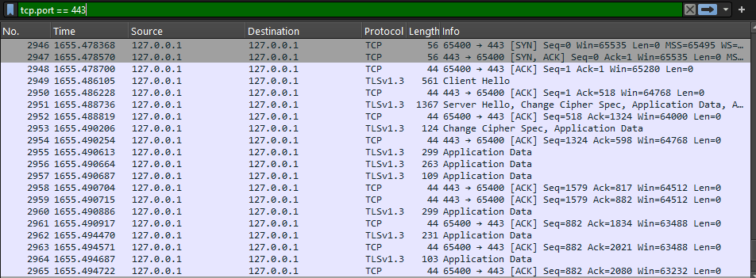

# CWE-311 Missing Encryption of Sensitive Data

## Descripción
El producto no encripta información crítica o sensible antes de almacenarla o transmitirla.

El servidor puede ser iniciado utilizando el comando:

## Pasos de ejecución
```bash
// Construcción de los servicios
docker-compose up --build
```
El cliente que tramitará las peticiones puede ser iniciado con:
```bash
python client/client.py
```


Una vez inicializados los servicios, a traves de herramientas de sniffing de tráfico en red como **Wireshark** o **tcpdump**
Se podrá observar una comunicación por TLS, que no revela información sensible al ser transportada por un canal seguro.
