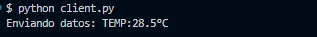
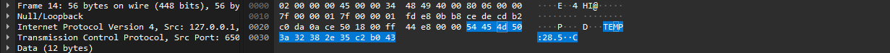
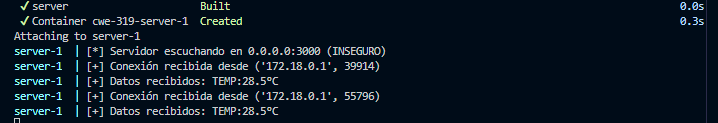

# CWE-319 Cleartext Transmission of Sensitive Information

## Descripción
El producto transmite información sensible o de seguridad crítica en texto plano en un canal de comunicación que puede ser interceptado por actores sin autorización.

## Pasos de ejecución

Simulación de envió de información de un sensor a través de http.

```bash
// Construcción de imagen e inicialización de conteneder
docker-compose up --build
```
Una vez inicializado el servicio, se podrá simular el envió de información, ejecutando el script de cliente:

```bash
python client.py
```




