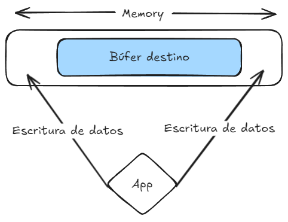

# CWE-787: Out-of-bounds Write

## Descripción
El producto escribe datos más allá del final, o antes del principio, del búfer previsto.


## Pasos de ejecución 

Ejecuta el servidor
```bash
// Construcción del servicio
docker-compose up --build
```
Una vez el servidor arranque construye la imagen del cliente y ejecuta el contenedor:
```bash
// Construcción de la images
docker build ./client -t cwe-787-client

// Construcción del contenedor
docker run -it --network=host cwe-787-client
```

Con el contenedor interactivo, ejecuta el comando:
```bash
nc -u 127.0.0.1 12345
```
Envía un mensaje que supere el `BUFFER_SIZE 16` y observa como la aplicación no es capaz de crashear gracias a que existe un control de la cantidad de datos a recibir.
```c
void process_data(char *data) {
    char buffer[BUFFER_SIZE];
    strncpy(buffer, data, BUFFER_SIZE - 1);
    buffer[BUFFER_SIZE - 1] = '\0';  // Ensure string termination
    printf("Received data: %s\n", buffer);
}
```
