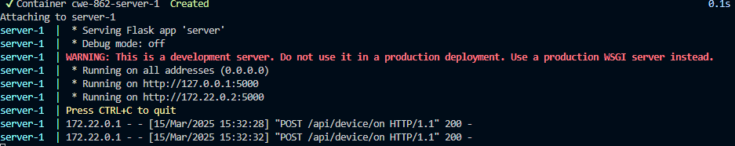
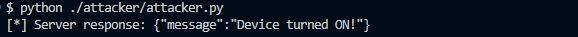

# CWE-862 – Missing authorization 

## Descripción
El producto no realiza una comprobación de autorización cuando un actor intenta acceder a un recurso o realizar una acción.

## Pasos de ejecución 

Construye los servicios ejecutando
```bash
// Construcción del servicio
docker-compose up --build
```

Ejecuta una petición de parte del atacante utilizando 
```
python ./attacker/attacker.py 
```

Veras como sin ningua autenticación puedes activar y desactivar dispositvos.

