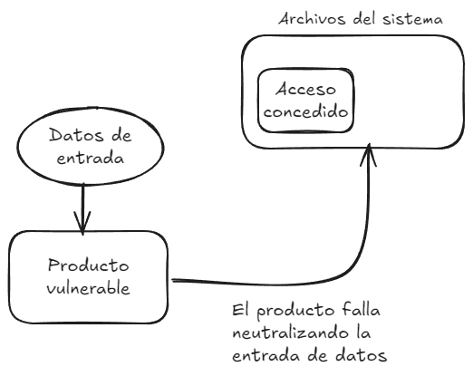

# CWE-22 - Improper Limitation of a Pathname to a Restricted Directory ('Path Traversal')

## Descripción
El producto utiliza una entrada externa para construir un nombre de ruta de acceso que está destinado a identificar un archivo o directorio que se encuentra debajo de un directorio principal restringido, pero el producto no neutraliza correctamente los elementos especiales dentro del nombre de ruta que pueden hacer que el nombre de ruta se resuelva en una ubicación que está fuera del directorio restringido.



## Pasos de ejecución

Construye la imagen utilizando el comando
```
docker build . -t cwe-22
```

Crea un contenedor a partir de la imagen
```
docker run -it -p 5000:5000 cwe-22
```

Observa como al lanzar una petición de la forma `http://localhost:5000/get-config?file=../../etc/passwd` es posible enumerar información del sistema.