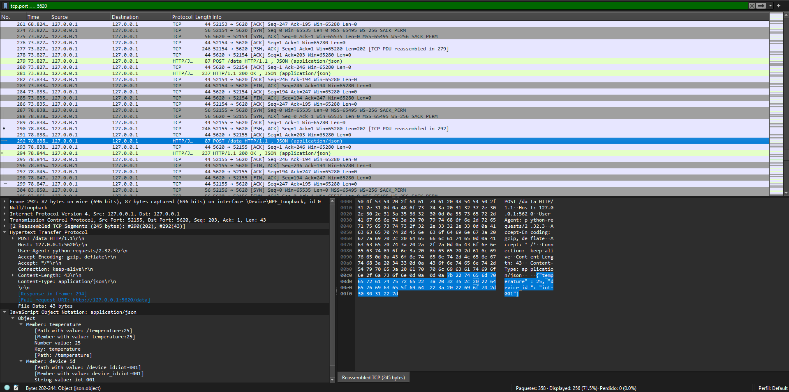

# CWE-311 Missing Encryption of Sensitive Data

## Descripción
El producto no encripta información crítica o sensible antes de almacenarla o transmitirla.

El servidor puede ser inicializado utilizando el comando:
```
docker-compose up --build
```
Una  vez inicializado el servidor, se podrán tramitar peticiones haciendo uso del script de cliente.
```bash
python client/client.py
```
```python
import requests
import time

SERVER_URL = "http://127.0.0.1:5620/data"

while True:
    data = {"temperature": 25, "device_id": "iot-001"}
    response = requests.post(SERVER_URL, json=data)
    print(f"Sent data: {data}, Response: {response.status_code}")
    time.sleep(5)

```
Este estára tramitando peticiones cada 5 segundo e utilizando un analizador de red como **Wireshark** se podrá observar como se tramita en texto plano a través de la red. 
