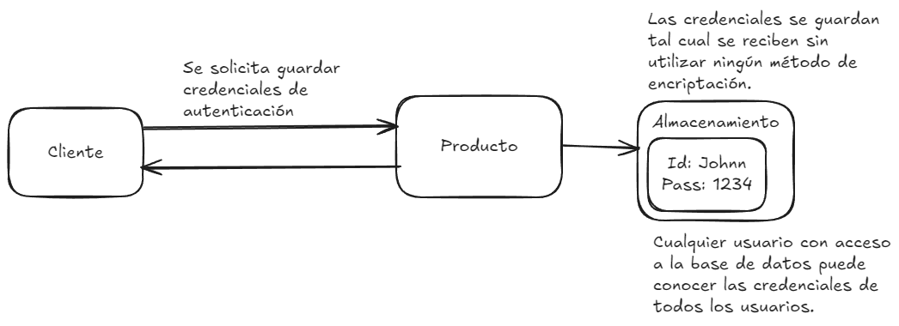

# CWE-522 Insufficiently Protected Credentials
## Descripción
El producto transmite o almacenas credenciales de autenticación, pero utiliza un método inseguro que es susceptible a una intercepción y o recuperación.



## Pasos de ejecución
La aplicación de ejemplo se puede ejecutar de la siguiente manera:

```bash
docker-compose up --build
```
Iniciada la aplicación se desplegaran un contenedor exponiendo una aplicación web por el puerto 5000.
Utilize su navegador para acceder a `http://localhost:5000/get-credentials`
Observe como las credenciales se muestran en texto plano, sin ningun método de encriptación, además observe como están guardadas en un archivo dentro del servidor.